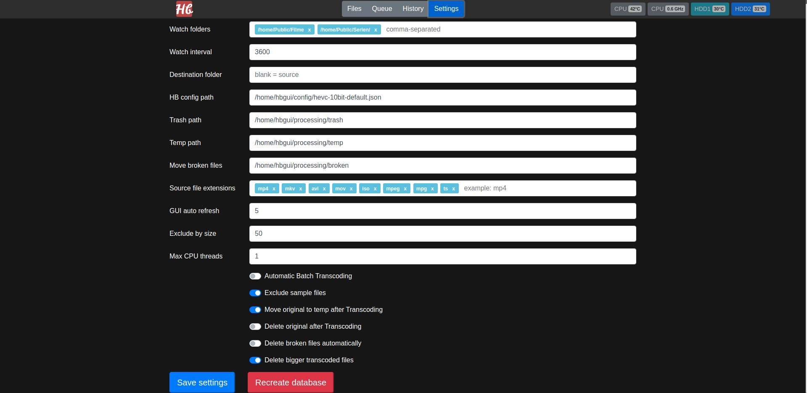

 HBGui
===================
This web application should run on the lately released Raspberry Pi 4 and will just be optimized for this hardware. The target system is Raspbian 32bit, so it is possible this application also runs on other versions of debian. I have specific use case where I run my Raspi 4 as NAS with 2 drives. Since the Raspi 4 is online 24/7 and I wanted to free up some space and were unsatisfied with the solutions out there, I created my own GUI. There are other projects like HBBBeast and x265ize, but they either only provide an ugly GUI or need tons of software to be run with. My aim is to not make use of so much dependencies and just rely on the tools which are build in PHP and the system itself.

Features
===================
- Scanning folders for video files
- Choosing the extensions to be scanned
- Excluding sample-files or files by size
- Transcoding all sorts of video files to HEVC and maybe other profiles
- Automating the app to be run unattended (for batch transcoding)
- Possibility to provide different profiles for transcoding
- 3 different approaches to detect broken files
- Moving of broken files for manual review (or delete them automatically)
- Uniquely identify files and thus detecting removed files
- Detecting meta data (1 approach to detect broken files)
- Easy to be accessed data storage (sqlite db)

Screenshots
===================

Dependencies
===================
- ffmpeg
- php7.3
- php7.3-sqlite module
- webserver (apache, nginx, ...) with PHP enabled

Install
===================
1. clone this repository
2. point your webserver to the cloned folder and chown it recursively
3. chown all folders recursively which should be watched for webserver
4. review /bash to adjust even more settings to get an overview of temps for your Raspi 4
5. open the webinterface and configure as you want
6. click "Files" and HBGui should automagically start scanning your system

Notes
===================
Do not alter the datasets while "Fetching Metadata" or other messages being displayed! If some of your watch folders being modified (user, group) by another program, try to add the webserver to the modifying group.
